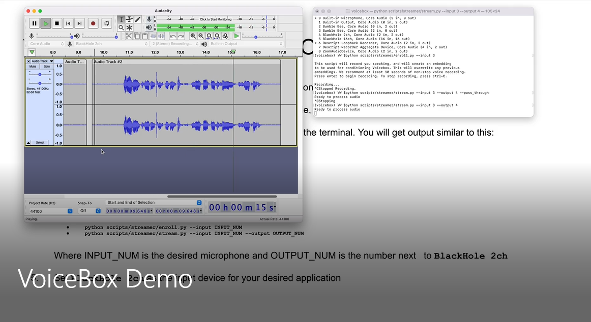

<h1 align="center">VoiceBlock</h1>
<h4 align="center"> Privacy through Real-Time Adversarial Attacks with Audio-to-Audio Models</h4>
<div align="center">

[](https://colab.research.google.com/github/???/???.ipynb)
[](https://master.d3hvhbnf7qxjtf.amplifyapp.com/)
[](/LICENSE)

</div>
<p align="center"></p>


## Contents

* <a href="#install">Installation</a>
* <a href="#reproduce">Reproducing Results</a>
* <a href="#streamer">Streaming Implementation</a>
* <a href="#citation">Citation</a>

<h2 id="install">Installation</h2>

1. Clone the repository:

        git clone https://github.com/voiceboxneurips/voicebox.git

2. We recommend working from a clean environment, e.g. using `conda`:

        conda create --name voicebox python=3.9
        source activate voicebox 

3. Install dependencies:

        cd voicebox
        pip install -r requirements.txt
        pip install -e .

4. Grant permissions:

        chmod -R u+x scripts/

<h2 id="reproduce">Reproducing Results</h2>

To reproduce our results, first download the corresponding data. Note that to download the [VoxCeleb1 dataset](https://www.robots.ox.ac.uk/~vgg/data/voxceleb/vox1.html), you must register and obtain a username and password.

| Task | Dataset (Size) | Command |
|---|---|---|
| Objective evaluation | VoxCeleb1  (39G) | `python scripts/downloads/download_voxceleb.py --subset=1 --username=<VGG_USERNAME> --password=<VGG_PASSWORD>` |
| WER / supplemental evaluations | LibriSpeech `train-clean-360` (23G) | `./scripts/downloads/download_librispeech_eval.sh` |
| Train attacks | LibriSpeech `train-clean-100` (11G) | `./scripts/downloads/download_librispeech_train.sh` |


We provide scripts to reproduce our experiments and save results, including generated audio, to named and time-stamped subdirectories within `runs/`. To reproduce our objective evaluation experiments using pre-trained attacks, run:

```
python scripts/experiments/evaluate.py
```

To reproduce our training, run:

```
python scripts/experiments/train.py
```

<h2 id="streamer">Streaming Implementation</h2>

As a proof of concept, we provide a streaming implementation of VoiceBox capable of modifying user audio in real-time. Here, we provide installation instructions for MacOS and Ubuntu 20.04.

<h3 id="streamer-mac">MacOS</h3>

See video below:

<a href="https://youtu.be/LcNjO5E7F3E">
<p align="center"></p>
</a>

<h3 id="streamer-ubuntu">Ubuntu 20.04</h3>


1. Open a terminal and follow the [installation instructions](#install) above. Change directory to the root of this repository.

2. Run the following command:
   
        pacmd load-module module-null-sink sink_name=voicebox sink_properties=device.description=voicebox

   If you are using PipeWire instead of PulseAudio:
        
        pactl load-module module-null-sink media.class=Audio/Sink sink_name=voicebox sink_properties=device.description=voicebox
        
   PulseAudio is the default on Ubuntu. If you haven't changed your system defaults, you are probably using PulseAudio. This will add "voicebox" as an output device. Select it as the input to your chosen audio software.

3. Find which audio device to read and write from. In your conda environment, run:
  
        python -m sounddevice

   You will get output similar to this:
  
          0 HDA Intel HDMI: 0 (hw:0,3), ALSA (0 in, 8 out)
          1 HDA Intel HDMI: 1 (hw:0,7), ALSA (0 in, 8 out)
          2 HDA Intel HDMI: 2 (hw:0,8), ALSA (0 in, 8 out)
          3 HDA Intel HDMI: 3 (hw:0,9), ALSA (0 in, 8 out)
          4 HDA Intel HDMI: 4 (hw:0,10), ALSA (0 in, 8 out)
          5 hdmi, ALSA (0 in, 8 out)
          6 jack, ALSA (2 in, 2 out)
          7 pipewire, ALSA (64 in, 64 out)
          8 pulse, ALSA (32 in, 32 out)
        * 9 default, ALSA (32 in, 32 out)
  
   In this example, we are going to route the audio through PipeWire (channel 7). This will be our INPUT_NUM and OUTPUT_NUM

4. First, we need to create a conditioning embedding. To do this, run the enrollment script and follow its on-screen instructions:
  
        python scripts/streamer/enroll.py --input INPUT_NUM

5. We can now use the streamer. Run:
  
        python scripts/stream.py --input INPUT_NUM --output OUTPUT_NUM

6. Once the streamer is running, open `pavucontrol`.

   a. In `pavucontrol`, go to the "Playback" tab and find "ALSA pug-in [python3.9]: ALSA Playback on". Set the output to "voicebox".

   b. Then, go to "Recording" and find "ALSA pug-in [python3.9]: ALSA Playback from", and set the input to your desired microphone device.

<h2 id="citation">Citation</h2>

If you use this your academic research, please cite the following:

```
@inproceedings{authors2022voicelock,
title={VoiceBlock: Privacy through Real-Time Adversarial Attacks with Audio-to-Audio Models},
author={Patrick O'Reilly, Andreas Bugler, Keshav Bhandari, Max Morrison, Bryan Pardo},
booktitle={Neural Information Processing Systems},
month={November},
year={2022}
}
```
